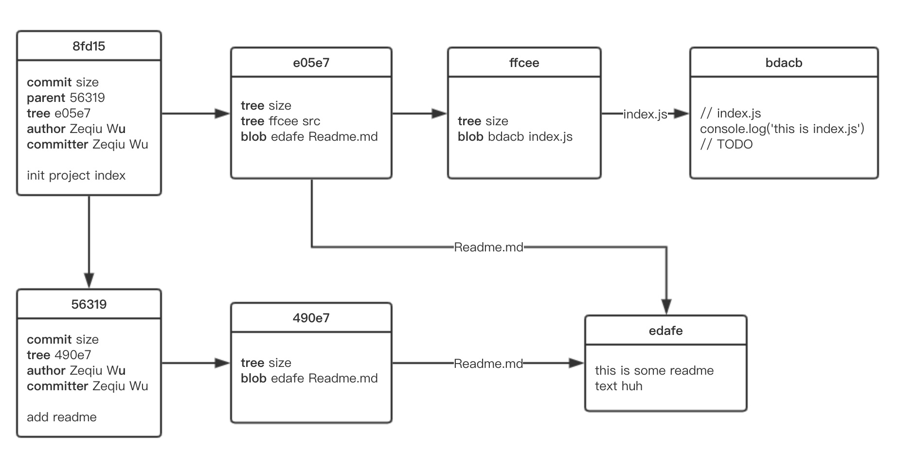
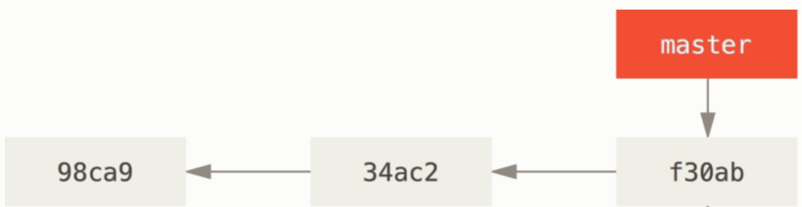

title: 浅析 git 数据管理
date: 2019-09-01
tags:
- git

---

两个月前，团队来了个新的实习生。我们让他协助开发一个 Java 服务。第二天发生了一个鬼故事：

> *实习生花了1个小时来下载 git 工作仓库*

<!--more-->

好不容易下载到本地，可见的代码本身只有几十 M 的大小，但在命令行中查看仓库时，发现在 `.git` 目录中有一个名为 `xxxx.pack` 的文件，大小竟然有 1.6G。

这时我和实习生都懵逼了：

> 为什么这个文件会这么大？这个文件是干嘛的？

我突然发现，自己每天都在使用的 git，其实背后隐藏了大量自己不了解的细节。这篇文章的出发点，就是对其中自己不求甚解的部分，做一个充分的解读。

## Pre-requisite

为了便于理解，在阅读这篇文章前，你需要对 git 有基本的使用经验。如果没有的话，可以先从廖雪峰的 [git 教程](https://www.liaoxuefeng.com/wiki/896043488029600) 开始。

读者也可以看下 [图解 git](https://marklodato.github.io/visual-git-guide/index-zh-cn.html)，可以对 git 基本操作有更直观的认识。

## 目录

- 版本控制的本质
- git 文件管理
  - 三个文件区域
  - 文件的四种状态
  - git 数据库
- 分支的秘密
  - 从分叉到分支
  - HEAD
  - ref, refs! {WIP}
  - 分支的合并
- 回到 .pack 文件 -- git 优化

## 版本控制的本质

想象一下，我们正在开发一个项目：没有 git，没有 SVN，没有任何可用工具。**我们如何保证：可以保留这个项目不同的版本，当某一个版本出了问题时，可以回到上一个版本呢？**

这里的 **版本**，可以理解为：当前项目中的 **所有文件的副本** 的集合。比如：

> 1. 今天早上10点，某同事 A 向项目中添加了 `list.js`，加了10行代码
> 2. 下午3点，某同事 A 发现 `list.js` 里有 bug，于是修改了其中的3行代码
> 3. 晚上8点，某同事 B 添加了一个新功能，又给 `list.js` 增加了20行代码

以上的每一个操作之后，我们都得到了1个关于 `list.js` 在这个仓库中的副本。所谓版本控制，无非就是控制某个文件夹中所有的文件（包括嵌套文件夹里的文件）的副本，并允许我们随意地调用这些副本的数据。

所以回到没有版本控制工具的时候，最简单的方法当然是：`Ctrl-C` + `Ctrl-V` —— 当我们需要保留其中一个「版本」时，我们可以先将整个项目文件夹的代码，复制出来，然后取个名字 *v1*，甚至再压缩打包一下变成 *v1.zip*，然后存起来。这样不断重复，对每一个值得保存的修改，我们都给它执行这样的操作，得到 *v2, v3, v4, ...*

这样，当我们发布了一个新版本时，如果它有问题，我们可以很快的恢复到上一个版本；每个文件在每个版本的副本，都被保留下来了。

**这当然是一种有效的做法，但它确实又是一个低效的做法：**

* 道理上来说，我们只要保存每个新的「版本」中被修改过的文件就行了，不需要所有的文件都复制一遍
* 复制粘贴重命名的操作，重复繁琐，且容易出错（万一搞错版本号，那就糟糕了）
* 如果有多个人一起工作怎么办呢？怎么约定所谓的「版本号」呢？
* 如果两个人都希望发布一个新版本，但两个人修改的代码是同一个位置又怎么办呢？
* ...

带着这些问题，我们来审视一个版本控制工具，它必须要能够解决以下几个问题：

1. 它可以在每个版本中 “保存” 每个文件的副本（特别是，修改过的文件）
2. 它可以保证「版本号」的唯一性
3. 当有多个人一起协作时，它可以通过某些规则，解决不同人对同一个文件的修改的合并问题
4. ...

接下来我们将看看 git 是如何分别解决这些问题的。

## git 文件管理

在详细介绍 git 文件管理之前，希望大家可以把一句话先牢牢记下来：

> *git 保存的不是文件的变化或者差异，而是一系列不同时刻的文件快照*
> <br>
> *git 保存的不是文件的变化或者差异，而是一系列不同时刻的文件快照*
> <br>
> *git 保存的不是文件的变化或者差异，而是一系列不同时刻的文件快照*

当我们在 git 仓库中提交更新，或者保存项目状态时，git 会对当时的全部文件制作副本（也可以称为“快照”），并为每份快照都提供一个独立的索引。如果有些文件没有被更新，那么 git 不会对其生成新的副本，而是在提交记录中保留指向之前存储的文件的链接。

### 三个文件区域

git 项目中有三个文件区域的概念：

* 首先，git 会将所有的代码副本和项目元数据（提交历史，目录结构），都存放在一个 `.git` 的目录中。我们称这个目录为「版本库」；
* 此外，当前的工作目录，直接可见的部分，我们称为「工作区」；
* 最后，为了方便记录我们对文件的修改，git 还提供了一个「暂存区」（`staging area`），临时寄放我们新增的或者修改过的文件，相当于一个等候区。

一般我们会在「工作区」中新增或者修改某些文件，然后执行 `git add` —— 这时被添加的文件的快照将被放入到「暂存区」，直到我们通过 `commit` 指令提交这些变更，永久地存入到「版本库」中。

如果我们希望可以在「工作区」中查看某个版本的数据，我们可以通过 `checkout` 指令，从「版本库」中调档，把某个版本的数据调取出来。


### 文件的四种状态

虽然 git 有三个文件区域，但实际上在项目中的文件，理论上可以有4种不同状态：

* `untracked` - git 还没有「跟踪」该文件
* `unmodified` - 当前文件和最近提交记录的文件的状态，是完全一致的
* `modified` - 当前文件和最近提交记录的文件相比，做了一定的修改
* `staged` - 文件做了修改，且这些修改被暂存起来了。

每个状态以及更改文件状态的 git 操作，如下图所示。


注：对于某些我们不希望 git 去管的文件，我们可以在它位于 `untracked` 状态时，通过 `.gitignore` 中的规则，让 git 忽略它们的存在。

这基本是绝大部分 git 教程会告诉我们的东西。但这里请大家思考两个问题：

1. **git 通过什么判断我的某个文件是否为 `untracked` ？所谓「跟踪」又是什么意思呢？**
2. **说 `.git` 目录代表了 git 的「版本库」，那具体的代码副本是如何存放的呢？**

这就要从 git 的核心：git 数据库说起。

### git 数据库

**git 的核心部分是一个简单的 key-value 数据库：** 

1. 你可以向数据库插入任意类型的内容，它会返回一个键值，通过键值可以在任意时刻再次查询该内容。
2. 这些数据都是存储在 `.git/objects` 目录里的，以文件的形式存放。
3. `key` 的值是一个 *40位的 SHA-1 hash*，hash 的前2个字符用于命名子目录，余下的38个字符用作文件名

在 git 数据库中，有4种不同类型的对象：

* blob - 记录单个文件的数据
* tree - 对应记录文件夹节点的数据
* commit - 记录一次提交记录
* tag - 记录一个 tag

我们在下一节会提到它们的具体形态和数据结构，但目前我们先不纠结这个，只需要知道有这几样东西就可以了。

让我们通过一个实际的例子，进行日常的 git 操作，然后查看 git 的原始数据存放情况。

#### 举一个栗子

首先我们创建一个空的文件夹，作为我们的项目地址，并用 `git init` 将它初始化：

```sh
$ mkdir git-demo
$ cd git-demo
$ git init   # 这就创建好了
```

目前项目空空如也。但实际上 git 仓库已经就绪，我们可以看下 `.git` 目录：

```sh
$ tree .git  ### 以下是输出结果
.git
├── HEAD
├── config
├── description
├── hooks
│   ├── applypatch-msg.sample
│   ├── commit-msg.sample
│   ├── post-update.sample
│   ├── pre-applypatch.sample
│   ├── pre-commit.sample
│   ├── pre-push.sample
│   ├── pre-rebase.sample
│   ├── pre-receive.sample
│   ├── prepare-commit-msg.sample
│   └── update.sample
├── info
│   └── exclude
├── objects
│   ├── info
│   └── pack
└── refs
    ├── heads
    └── tags

8 directories, 14 files
```

这里我们先抛开别的文件，只看 `objects` 目录。不难看出，它现在只有 `info` 和 `pack` 两个文件（我们稍后再提到他们）

我们尝试给文件夹里添加点东西：

```sh
$ mkdir src
$ touch Readme.md src/index.js
$ echo 'this is some readme text huh' > Readme.md
```

然后我们再查看 `.git/objects`：

```sh
$ tree .git/objects
.git/objects/
├── info
└── pack

2 directories, 0 files
```

呵...并没有任何变化。那如果我们把其中一个文件放到「暂存区」呢：

```sh
$ git add Readme.md
$ tree .git/objects
.git/objects/
├── ed
│   └── afe27e250ef26f694b25afce81bdaf96f44eb0
├── info
└── pack

3 directories, 1 file
```

哦豁 —— 在 `.git/objects` 下多了一个文件夹 `ed`，文件夹下又带有一个名为 `afe27e250ef26f694b25afce81bdaf96f44eb0` 的文件，串在一起 `edafe27e250ef26f694b25afce81bdaf96f44eb0` 刚好是40个字符，这就是 git 对这个文件生成的 SHA-1 hash。

我们可以用 `git cat-file` 来瞧瞧这个文件：

```sh
$ git cat-file -p edafe27e250ef26f694b25afce81bdaf96f44eb0 # -p 输出 git 对象的内容
this is some readme text huh

$ git cat-file -t edafe27e250ef26f694b25afce81bdaf96f44eb0 # -t 输出 git 对象的类型
blob
```

所以在我们添加一个文件到「暂存区」时，git 会对应地创建一个 `blob` 类型的对象（文件），且这个文件的路径是由一个 40 位的 SHA-1 hash 指定的。

接下来我们提交这个位于「暂存区」的文件：

```sh
$ git commit -m 'add readme'
[master (root-commit) 4245348] add readme
 1 file changed, 1 insertion(+)
 create mode 100644 Readme.md

$ tree .git/objects
.git/objects
├── 12
│   └── 0c03e073cdf409403224c406fdfb022a63e750
├── 49
│   └── 0e706c59461270e6f3c0d47356ac84e8c0bc1b
├── ed
│   └── afe27e250ef26f694b25afce81bdaf96f44eb0
├── info
└── pack

5 directories, 3 files
```

这次提交后，我们发现，除了原本的 `edafe...` 外，`objects` 里面又多了两个文件：`49/0e7...` 和 `12/0c0...`；同样我们可以分别查看这两个文件：

```sh
$ git cat-file -t 120c03e073cdf409403224c406fdfb022a63e750
commit

$ git cat-file -p 120c03e073cdf409403224c406fdfb022a63e750 
tree 490e706c59461270e6f3c0d47356ac84e8c0bc1b
author Zeqiu Wu <allenwu1018@gmail.com> 1567341827 +0800
committer Zeqiu Wu <allenwu1018@gmail.com> 1567341827 +0800

add readme

```

不难看出，这第一个文件对应的是一个 `commit` 类型的对象；对象中的数据记录了这个 commit 的作者和提交者，还有 commit msg；此外，还包含了一行记录：`tree 490e706c59461270e6f3c0d47356ac84e8c0bc1b`，这里的 SHA-1 hash 恰好是另一个文件的 SHA-1 hash：

```sh
$ git cat-file -t 490e706c59461270e6f3c0d47356ac84e8c0bc1b
tree

$ git cat-file -p 490e706c59461270e6f3c0d47356ac84e8c0bc1b
100644 blob edafe27e250ef26f694b25afce81bdaf96f44eb0	Readme.md
```

而第二个文件则是一个 `tree` 类型的对象。它的内容包含了 `Readme.md` 这个文件的名称，对应的 git blob 对象的 SHA-1 hash 和文件模式（100644）。

这时我们的几个 git 对象之间的关系是这样的：


随后我们在 `src/index.js` 中编写一段代码，并提交：

```js
// index.js
console.log('this is index.js')
// TODO
```

```sh
$ git add src/index.js
$ git commit -m 'init project index'
```

这时候我们再看 `.git/objects`：

```sh
$ tree .git/objects
.git/objects
├── 12
│   └── 0c03e073cdf409403224c406fdfb022a63e750
├── 49
│   └── 0e706c59461270e6f3c0d47356ac84e8c0bc1b
├── 8f
│   └── d15dbfbba5fd5b981de38f5177c8029693f4fb
├── bd
│   └── acba00da0ef745a2bdfdee7844ecc97db19cb0
├── e0
│   └── 5e71a0142e288df830343f06c2e9549511b159
├── ed
│   └── afe27e250ef26f694b25afce81bdaf96f44eb0
├── ff
│   └── cee3ab51c6a5903bc8a9ca9378a5672e44ea36
├── info
└── pack

9 directories, 7 files
```

唔，有点多哈。我们先排除掉上一次提交中涉及的3个 git 对象：`120c0...`, `490e7...` 和 `edafe...`。那么我们就还有4个对象。逐一分析可以得到：

* `8fd15...` - `commit` 对象，内容为：
  * **tree** `e05e7...`
  * **parent** `120c0...`
  * **author** `Zeqiu Wu`
  * **committer** `Zeqiu Wu`
  * **commit 信息** `init project index`
* `bdacb...` - `blob` 对象，内容为刚才我们写入的三行 JS 脚本
* `e05e7...` - `tree` 对象，内容为：
  * `100644` `blob` `edafe...` `Readme.md`
  * `040000` `tree` `ffcee...` `src`
* `ffcee...` - `tree` 对象，内容为：
  * `100644` `blob` `bdacb...` `index.js`

用图来表示会更直观一些：


第二个 commit 的图中，包含了很多信息。

首先，相比于上一个图，不难留意到 `490e7...` 这个 tree 对象的内容中，除了包含对 blob 对象的引用外，还包含对另一个 tree 对象的引用：`ffcee...`，且引用中注明了 `src` 这个文件夹名称。

从概念上讲，从项目顶层目录开始，git 储存的实际数据结构有点像这样：


在最顶端总会有一个 `tree` 对象；如顶层目录下还有别的文件夹，则就文件夹本身会有一个额外的 `tree` 对象记录。

另外，在上一个 commit 中出现的 `Readme.md` 仍然出现在图中，只是这次是一个名为 `490e7...` 的 tree 对象记录了 `Readme.md` 的 blob 对象的 hash。

此外，还需要注意的是 `a1a6b...` 这个 commit 对象，除了包含 tree 引用，提交者信息和 commit 日志外，还附带了一个 `parent` 信息，正好是上一个 commit 的 SHA-1 hash `56319...`

如果我们将 `.git/objects` 里所有的对象都放到一个图中，就会是这样的：



其中的对象间的关系，大家可以尝试自己体会 :p

### git 对象小结

从上一节的例子中，我们可以得到一些基本的结论：

* git 通过在「版本库」（即 `.git/objects`）中创建一个路径唯一的文件来记录（或者叫”跟踪“）一个 git 对象。这个文件的路径由一个长度为 40 的 SHA-1 hash 分拆组成。
* 我们知道有三种 git 对象：blob, tree, commit（有兴趣的读者可以自行研究 tag 对象）
* blob 对象对应某个文件在某个时间点上的内容。
* commit 和 tree 对象的数据中会包含对 tree 或 blob 对象的指针
* tree 对象可以视作代表 “文件夹” —— tree 对象的指向关系，本质上就是对应文件夹关系的一颗树
* 从第二个开始的所有 commit 对象，都会包含指向其上一个 commit 的指针

  

## 分支的秘密

基于 git 的对象理论，我们来尝试剖析 git 分支的具体形态，以及对分支的各种操作。

### 从分叉到分支

从上一节中，我们知道除了第一个 commit 外，每个 commit 都会包含对上一个的指针。那么假如某个 git 项目一直只有一个人在开发，那么这个 git 项目的 commit 记录就会组成1条简单的直线。

但如果是两个人在开发，必然会出现并行工作的情况（总不能 A 先眼巴巴等着 B 开发完再开发吧），在提交历史上我们就会出现分叉。

git 提供了「分支」的概念来支持用户进行分叉操作。**git 的分支本质上只是指向 commit 对象的可变指针**，让我们来详细说明这一点：

在我们新建一个仓库并完成提交（或者从远程同步一个仓库到本地）时，都会发现当前已经存在一个叫做 `master` 的分支。这是因为 git 默认会创建一个名为 `master` 的指针，并指向最近一次的 commit 对象。在每次 commit 后，`master` 指针会跟着移动，指向新生成的 commit 对象。这时候的状态如下图：



我们可以创建一个新的分支：

```sh
$ git branch testing # 在当前提交对象上创建一个新的指针
```

> 注：git branch 操作中，git 实际上会运行一个 update-ref 指令，有兴趣的同学可以进一步研究。

于是我们得到这样一个状态：


这里的 `master` 和 `testing` 都指向了同一个 commit 对象，且本质上这两个分支（指针）是平等的（`master` 只不过是 git 默认分支的名字）。问题来了，如果接下来我们要做一个新的提交，是两个分支都跟着移动么？还是只有 `master`？什么时候 `testing` 会跟着往前走呢？

这就取决于：**当前我们使用哪一个指针**，或者说：**当前我们在哪个分支上**

那接下来的问题就是：git 如何知道当前在哪一个分支上呢？

### HEAD

答案是 git 使用了名为 `HEAD` 的特殊指针。git 仓库的 **当前文件** 的状态，总是对应 `HEAD` 指针所指向的提交对象对应的快照。


通过 `git status` 我们可以看到当前我们还是在 `master` 分支上（尽管我们已经创建了 `testing` 分支），然后我们可以查看下各个分支指向的对象，这和上面的图例结果是吻合的：

```sh
$ git log --oneline --decorate
f30ab (HEAD, master, testing) add feature #32 - ability to add new
34ac2 fixed bug #1328 - stack overflow under certain conditions
98ca9 initial commit of my project
```

我们可以通过 `checkout` 指令让 `HEAD` 指针从指向 `master` 改成指向 `testing`：

```sh
$ git checkout testing
Switched to branch 'testing'
```

这时 `HEAD` 指向 `testing` 分支。


> 注意, 这里不要和 SVN 的 checkout 搞混了, 它们完全不同

这时如果我们再做一个新的 commit，则 `testing` 分支（指针）将跟着往前，指向新的 commit，同时 `HEAD` 也会自觉地跟着新的 commit：


然后我们可以再让 `HEAD` 指向 `master`：

```sh
$ git checkout master
Switched to branch 'master'
```


最后我们又做一个 commit，让分叉出现，哦豁！


### refs, refs!

我们现在知道 HEAD 是一个指向当前分支（即一系列 commit 链条上的最后一个）的指针，也知道 `master` 和 `testing` 也是指向最后一个 commit 的指针。那它们具体的存在形式是怎样的呢？

我们先从 HEAD 开始研究。让我们再看一次 `.git` 文件夹的结构：

```sh
.git
├── HEAD
├── config
├── description
├── hooks (若干个 git hook 文件, 此处省略)
├── info (暂时省略)
├── objects (git 原始对象存放地点, 省略)
└── refs
    ├── heads
    └── tags
```

我们留意到恰好有一个名为 HEAD 的文件。查看它的内容：

```sh
$ cat .git/HEAD
ref: refs/heads/master
```

我们发现 HEAD 文件中提到了 `refs/heads/master`。让我们来试下切换分支到 testing，更改 HEAD 的指向：

```sh
$ git checkout testing
$ cat .git/HEAD
ref: refs/heads/testing
```

观察 `refs/heads` 目录：

```sh
$ ls .git/refs/head/
master  testing

$ cat .git/refs/head/master
a1a6b4ff321bb2c058632a231fce0e56ab2ab3f3

$ cat .git/refs/head/testing
a1a6b4ff321bb2c058632a231fce0e56ab2ab3f3
```

如果这时我们希望再创建一个新的分支 `feat-abc`，可以利用上文提及的 `git branch` 指令。这时候 git 会创建一个新的指针 abc，这个 abc 指向的最后一个 commit 和 testing 一样：

```sh
$ git branch abc

$ ls .git/refs/head
master  testing  abc

$ cat .git/refs/head/abc # 注意观察输出的 SHA-1 值, 和上一段例子中 refs/head/testing 一样
a1a6b4ff321bb2c058632a231fce0e56ab2ab3f3

$ git checkout abc # 切换当前分支到 abc, 即让 HEAD 的值为 refs/head/abc
```

如果这时候我们再完成一个新的 commit，则当前的分支应用 abc 所指向的 commit 的值自然会发生改变。这就是我们日常开发中的过程了。

可以发现：`.git/refs/head` 下存放的文件，就是对应着各个现有的分支；且这些文件的内容就是其指向的 commit 的 SHA-1 hash 值。

**像 HEAD 和 refs/head/abc 这样的文件，在 git 中可以统称为引用（references, 或缩写为 refs）**

引用可以分为几种：HEAD 引用，分支引用，标签引用（tag reference）和远程引用。这里我们不对标签引用做过多的解释（有兴趣的同学可以自行查阅资料），仅对其他几种进行讨论。

#### HEAD 引用

在上文例子中提到的 `.git/HEAD` 就是 HEAD 引用。它是一个符号引用（symbolic reference），指向目前所在的分支。

所谓符号引用是指它本身不包含一个 SHA-1 hash，而是指向了其他的分支引用。如之前的例子所示，如果执行 `git checkout testing`，git 会将 HEAD 的值设为 `ref: refs/heads/testing`

> 注：其实 HEAD 也不是必须指向别的引用，它也是可以像普通引用一样包含一个具体的 commit SHA-1 hash，这样的 HEAD 被称为 detached HEAD

> 注2：checkout 指令底层所依赖的命令为 symbolic-ref，有兴趣的同学也可以进一步研究。

#### 分支引用

在上文例子中提到的 `.git/refs/xxx` 就是所谓的「分支引用」，它们的主要作用是让我们能够用可理解的代号，来指向某一个特殊的 commit，且允许我们在这个 commit 的基础上进行新的开发（提交 commit）

#### 远程引用

在开发中我们经常做的第一件事情，就是从某个可访问的地址获取某个项目的已有代码，这个可访问的地址被称为远程仓库。「远程引用」正是指向远程仓库某个分支的引用。

「远程引用」是只读的，它帮助我们记录已知的远程仓库上，各个分支和标签的状态。当然，如果实际上远程仓库发生了变化，本地的「远程引用」不会自动地跟踪；同样，本地也不可以直接修改「远程应用」所指向的分支。当我们做任何网络通信操作时，它会自动移动。它就像是你上次连接到远程仓库时，那些分支所处状态的书签。我们称「远程引用」所指向的远程仓库中的分支为「远程跟踪分支」。

我们可以通过 `git ls-remote (remote)` 或者 `git ls -r` 来显式获取远程引用的完整列表，也可以直接查看 `refs/remotes` 下的文件，比如：

```sh
$ ls .git/refs/remotes # 列举所有已知的远程仓库 
origin
$ ls .git/refs/remotes/origin # 列举 origin 下已知的引用(分支)
master feat-abc
$ cat .git/refs/remotes/origin/master # 查看远程仓库 origin 下 master 分支指向的 commit
....
```

由于 git 本地不会自动跟踪远程仓库的任何变化，所以我们需要显式地更新远程仓库的状态。我们可以通过 `git fetch` 来更新远程仓库上各个分支的最新状态。这里本质上是将远程仓库上各个分支的最新代码变更拉取到本地。

由于它实际上确实是一个本地可访问的分支，所以我们也可以将它合并到本地的某个分支上，比如当前我们位于 `master` 分支，希望将名为 origin 的远程仓库上最新的 master 分支 合并进来；那么我们可以：

```sh
$ git checkout master       # 切换到 master 分支
$ git fetch origin          # 更新 origin 下的所有分支
$ git merge origin/master   # 合并操作
```

更简单的方法是：我们在 `master` 分支上直接执行 `git pull origin master`，git 会自动识别去哪个服务器上抓取合并：`git pull origin master` => `git fetch origin` + `git merge origin/master`

因为这样的操作非常高频，所以 git 允许我们创建所谓的 **跟踪分支（tracking-branch）** 来简化同步代码的操作：我们只需要从一个「远程跟踪分支」中 checkout 出一个新的分支，git 就会认为这个新的分支 “跟踪” 了远程仓库中对应的分支：

```sh
$ git checkout origin/abc
$ git checkout -b abc
## 或者可以这样
$ git checkout --track origin/abc # 在本地创建一个同名的 abc 分支, 作为 "跟踪分支"
```

在「跟踪分支」上，我们可以直接用 `git pull` 而不需要指定对应的远程仓库和分支名称；像大家常见的 `git clone` 操作，实际上就会将 `master` 分支设置为 `origin/master` 分支的「跟踪分支」。

刚才我们简单提到了分支间的 merge 操作，接下来我们来详细分析 git 分支间的合并操作。
 
### 分支的合并

在真实的开发中，我们使用分支，是为了可以将新功能或者模块的开发，拆分到一个独立的环境中，这样我们可以不断地 commit 保存一些过程中的小功能点，而不需要担心这些 commit 会影响到整个系统可用的部分（通常来说，指 master）

让我们来看下这个图：


我们可以想象有这样的事情：

* 我们准备开发一个新功能，从 `master` 分支上建立了一个分支 `iss53`，并让 HEAD 指向这个分支（其实就是 `checkout`）
* 然后我们在 `iss53` 上做了一个 commit `C3`
* 随后老板 ~~（很生气地）~~ 告诉我们，线上有一个 bug，要尽快修复它；于是我们切换回 `master` 分支，然后在 `master` 分支上重新建立一个叫做 `hotfix` 的分支，然后在上面做了一个 `C4` 的 commit，应该可以修复这个紧急问题。

好了，接下来该干嘛？—— 我们应该想办法把 `hotfix` 上的内容合并到原来的 `master` 分支上。

这时我们就可以用上 `git merge` 这个功能了：

```sh
$ git checkout master # 让 HEAD 指向 master
$ git merge hotfix    # 将 hotfix 的内容合并到 master 分支上
Updating f42c576..3a0874c
Fast-forward
 index.html | 2 ++
 1 file changed, 2 insertions(+)
```

这样的合并属于「快进」（fast-forward）—— 由于 `master` 分支指向的提交是当前 `hotfix` 的提交的直接上游，所以 git 只是简单的将 `master` 的指针向前移动。

> 换句话说，当你试图合并两个分支时，如果顺着一个分支走下去能够到达另一个分支，那么 git 在合并两者的时候，只会简单的将指针向前推进（指针右移），因为这种情况下的合并操作没有需要解决的分歧——这就叫做「快进」（fast-forward）。

完成合并后，我们可以发布这个修复，然后可以回去继续开发新功能了；这时候 `master` 和 `hotfix` 都指向同一个 commit 对象。而 `iss53` 并没有变化。


我们可以清理掉不需要的 `hotfix` 分支，然后继续干活：

```sh
$ git branch -d hotfix # 删除分支
Deleted branch hotfix (3a0874c).

$ git checkout iss53
Switched to branch "iss53"

# ... do some work
$ git commit -a 'finished issue 53'
[iss53 ad82d7a] finished issue 53
1 file changed, 1 insertion(+)
```

这时候分支的情况：


开发好了 —— 现在我们需要把 `iss53` 这个分支合并回 `master` 分支。但这时两个分支之间产生了分叉。这时 git 会使用两个分支的最近的 commit `C4` 和 `C5`，连同两个分支的公共祖先 `C2` 一起做一个三方合并：

```sh
$ git checkout master
Switched to branch 'master'
$ git merge iss53
Merge made by the 'recursive' strategy.
index.html |    1 +
1 file changed, 1 insertion(+)
```

合并结束后，git 会用三方合并的结果创建一个新的 commit 记录下来。这个 commit 被称为 `merge commit`，它的特别之处在于它有不止一个父 commit：


这样工作就结束了，所有的修复，连同功能代码都被加到了 master 里面，是时候下班了~~

#### Merge Conflict

但事情并没有这么顺利，在一些情况下，我们会遇到无法处理合并的情况。比如说，假设刚才我们在 `iss53` 和 `hotfix` 的修改中，同时涉及了一个文件的同一处，当合并的时候就会产生一个冲突（conflict）：

```sh
$ git merge iss53
Auto-merging index.html
CONFLICT (content): Merge conflict in index.html
Automatic merge failed; fix conflicts and then commit the result.
```

> 原则上，git 会尽量自动合并两个分支对一个文件的修改。

当产生一个冲突时，git 不会自动生成一个 merge commit，而是会暂停下来，等待你去解决合并产生的冲突。可以用 `git status` 来查看：

```sh
$ git status
On branch master
You have unmerged paths.
  (fix conflicts and run "git commit")

Unmerged paths:
  (use "git add <file>..." to mark resolution)

    both modified:      index.html

no changes added to commit (use "git add" and/or "git commit -a")
```

这时需要我们手动去解决代码冲突。出现冲突的文件会包含一些特殊区段，类似这样：


git 将冲突的双方对该文件的修改，都保留在界面上，用 `=========` 来分割两部分。我们可以根据实际需要，选择其中的某个部分，或者自行合并内容。很多编辑器（如 VSCode）和 IDE（如 WebStorm）对处理冲突提供了很好的支持，也可以选择借助它们来处理。

> 这里最好的方式是拉上另一个分支的同伴（如果有多人协作的话）一起审查这个 conflict，这样可以避免单方面操作对某部分的代码造成意料之外的伤害。

当解决了所有冲突的文件后，我们可以运行 `git status` 确认这一事实：

```sh
$ git status
On branch master
All conflicts fixed but you are still merging.
  (use "git commit" to conclude merge)

Changes to be committed:

    modified:   index.html
```

如果没有问题，则可以用 `git commit` 来完成最终的 merge commit。

> 另一种情况是：我们发现实在是太难处理了，这时可以直接用 `git merge --abort` 取消这次合并的尝试 —— 这等于我们从来没有做过合并。然后我们叫一个老司机来协助解决这个问题。

## 回到 pack 的问题

说了这么多，让我们回到文章开头的问题：

> `xxx.pack` 文件是什么东西? 为什么它会这么大?

接下来我们逐个回答。

### Packfile

为了解释 packfile 的作用，我们基于 [举一个栗子](#举一个栗子) 中的 git 仓库，做一些操作：

首先我们向仓库提交一个体积较大的源文件。这里我们选取 [vue.js](https://vuejs.org) 源代码中 vdom 的核心代码 [`patch.js`](https://github.com/vuejs/vue/blob/dev/src/core/vdom/patch.js)：

```sh
$ curl https://raw.githubusercontent.com/vuejs/vue/dev/src/core/vdom/patch.js > src/patch.js
$ git add src/patch.js
$ git commit -m 'added patch.js'
```

观察 git 对 `patch.js` 的记录：

```sh
$ git cat-file -p master^{tree} # 查看当前 commit 记录下引用的 git 对象节点列表
100644 blob edafe27e250ef26f694b25afce81bdaf96f44eb0	Readme.md
040000 tree 8c6b7113372ebc4882180bff942b0ab02439aacc	src

$ git cat-file -p 8c6b7113372ebc4882180bff942b0ab02439aacc # 查看 src/ 下所有文件的 git 对象信息
100644 blob bdacba00da0ef745a2bdfdee7844ecc97db19cb0	index.js
100644 blob 2052df913b3f240f0407673b775a554d964cd15a	patch.js

$ git cat-file -s 2052df913b3f240f0407673b775a554d964cd15a # patch.js 大小大概是 26.5kb
26565
```

现在我们稍微对 `patch.js` 做一些修改：

```sh
$ echo '// appending one testing line' >> src/patch.js
$ git commit -am 'modified patch.js'
[master b823eae] modified patch.js
 1 file changed, 1 insertion(+)
```

重新观察 `patch.js`：

```sh
$ git cat-file -p master^{tree}
100644 blob edafe27e250ef26f694b25afce81bdaf96f44eb0	Readme.md
040000 tree ce9de001b849100b9405720c93fb5e54eac178dc	src

$ git cat-file -p ce9de001b849100b9405720c93fb5e54eac178dc
100644 blob bdacba00da0ef745a2bdfdee7844ecc97db19cb0	index.js
100644 blob aa79e3510892b6213cdd6f84aa321f00abb6eb70	patch.js
```

可以看到，`patch.js` 对应一个全新的 git blob 对象；也就是说，即便我们只是对文件做了1行的修改，git 也会重新生成一个新的文件的“副本”：

```sh
$ git cat-file -s aa79e3510892b6213cdd6f84aa321f00abb6eb70 # patch.js 大小几乎没有发生变化, 但这个 git 对象已经是一个全新的了
26595
```

在实际开发中，我们经常会对文件进行反复的修改，如果每次修改 git 都要重新生成一个副本，那仓库的实际体积将迅速增大！有没有办法只记录每次提交的变更内容，而不是单纯的将整个文件的状态完全保留下来呢？

事实上 git 是可以这么做的。刚才我们看到的 git 存储对象时所使用的格式被称为“松散（loose）“对象格式。但 git 会时不时将多个对象打包成一个称为 packfile 的二进制文件，以节省空间和提高效率。当版本库中有太多的松散对象时，git 会在我们和远程仓库进行通信（推送或拉取）时自动进行打包操作。

我们也可以通过 `git gc` 指令手动触发打包行为：

```sh
$ git gc
Counting objects: 15, done.
Delta compression using up to 8 threads.
Compressing objects: 100% (12/12), done.
Writing objects: 100% (15/15), done.
Total 15 (delta 1), reused 0 (delta 0)
```

这时候如果我们再观察 git 数据库的对象，则会发现我们在例子中看到的各个文件的副本都消失了，取而代之的是两个后缀分别为 `.idx` 和 `.pack` 的文件：

```sh
$ find .git/objects -type f
.git/objects/pack/pack-fb3f62dbf81ab8480462c2d7edfe36785c090c34.idx
.git/objects/pack/pack-fb3f62dbf81ab8480462c2d7edfe36785c090c34.pack
.git/objects/info/packs
```

分别观察这两个文件，发现它们的体积都很小：

```sh
$ du -sh .git/objects/pack/pack-fb3f62dbf81ab8480462c2d7edfe36785c090c3.pack
8.0K	.git/objects/pack/pack-fb3f62dbf81ab8480462c2d7edfe36785c090c34.pack

$ du -sh .git/objects/pack/pack-fb3f62dbf81ab8480462c2d7edfe36785c090c3.idx
4.0K	.git/objects/pack/pack-fb3f62dbf81ab8480462c2d7edfe36785c090c34.idx
```

这两个文件分别就是 packfile 和它的索引：

* packfile 包含了刚才从文件系统中移除的所有对象的内容
* 索引文件包含了包文件的偏移信息

我们通过索引文件就可以快速定位任意一个指定对象。观察打包前后的仓库大小，我们发现通过打包对象减少了 2/3 的磁盘占用空间。

git 是如何做到这点的？git 打包对象时，会查找命名及大小相近的文件，并只保存文件不同版本之间的差异内容。我们可以利用 `git verify-pack` 这个底层命令查看已打包的内容：

```sh
git-example-repo on  master ➜ git verify-pack -v .git/objects/pack/pack-fb3f62dbf81ab8480462c2d7edfe36785c090c34.idx
b823eae6cbbf9c2109ba3bee65ce6dc15768f585 commit 230 159 12
5f84f91f1166877d492f63b85ed7883b442b8bea commit 227 158 171
8fd15dbfbba5fd5b981de38f5177c8029693f4fb commit 231 157 329
120c03e073cdf409403224c406fdfb022a63e750 commit 175 122 486
edafe27e250ef26f694b25afce81bdaf96f44eb0 blob   29 36 608
bdacba00da0ef745a2bdfdee7844ecc97db19cb0 blob   52 54 644
aa79e3510892b6213cdd6f84aa321f00abb6eb70 blob   26595 6886 698
a14f60a7108b2693373c6206270f20078e67cf32 tree   67 78 7584
ce9de001b849100b9405720c93fb5e54eac178dc tree   72 79 7662
9fcd22f080fe51922392d4a8b1ef368c40193b0d tree   67 77 7741
8c6b7113372ebc4882180bff942b0ab02439aacc tree   72 78 7818
2052df913b3f240f0407673b775a554d964cd15a blob   9 20 7896 1 aa79e3510892b6213cdd6f84aa321f00abb6eb70
e05e71a0142e288df830343f06c2e9549511b159 tree   67 78 7916
ffcee3ab51c6a5903bc8a9ca9378a5672e44ea36 tree   36 47 7994
490e706c59461270e6f3c0d47356ac84e8c0bc1b tree   37 48 8041
non delta: 14 objects
chain length = 1: 1 object
.git/objects/pack/pack-fb3f62dbf81ab8480462c2d7edfe36785c090c34.pack: ok
```

这里的输出内容中，第3列就是 git 打包后对象的体积大小。我们可以留意下关于 `patch.js` 的两个 blob 对象的记录（读者可以向上对照下 SHA-1 hash 值）：

```
aa79e3510892b6213cdd6f84aa321f00abb6eb70 blob   26595 6886 698
2052df913b3f240f0407673b775a554d964cd15a blob   9 20 7896 1 aa79e3510892b6213cdd6f84aa321f00abb6eb70
```

其中第1行是 `patch.js` 第2个副本的记录，文件大小没有变化；而第2行中指向 `patch.js` 的最早的副本，大小只有9个字节，且附带了一个指向最新副本的指针。这里正是 git 通过内部 diff 的方式，将提交本身的变更内容保留了下来（并做了压缩），最终加入到 packfile 中。

那么至此我们可以简单地回答文章开头的问题了：

* `.pack` 文件是 git 的 packfile，是 git 打包操作后对松散 git 对象的压缩整合，最大限度地减少了磁盘占用的空间
* `.pack` 文件庞大的原因，是因为它需要保留整个 git 仓库绝大部分历史提交的信息

但问题还是存在的：我们的实习生用了1个小时来下载代码！如何解决这个问题呢？

### git 仓库的清理

如果我们去观察一些已有的开发仓库，通常会发现 `.git/objects/pack` 里有不止一个 `.pack` 和 `.idx` 文件，而且有些 `.pack` 非常的庞大。事实上，如果某个人在之前向项目添加了一个大小特别大的文件，即使你将这个文件从项目中移除了，每次克隆还是都要强制的下载这个大文件。 之所以会产生这个问题，是因为这个文件在历史中是存在的，它会永远在那里。

所以为了从根本上避免这个问题，我们需要对 git 提交历史上出现过的大文件进行永久的清理。这是一个非常麻烦的事情，读者可以参考以下几篇文章：

* https://git-scm.com/book/zh/v2/Git-%E5%86%85%E9%83%A8%E5%8E%9F%E7%90%86-%E7%BB%B4%E6%8A%A4%E4%B8%8E%E6%95%B0%E6%8D%AE%E6%81%A2%E5%A4%8D
* https://stackoverflow.com/questions/11050265/remove-large-pack-file-created-by-git
* https://help.github.com/en/articles/removing-sensitive-data-from-a-repository

当然，我也会尽快地在我们的开发仓库上应用一些实践，后续会在这里补充更多的操作方式细节。

## Reference

* [Pro Git, 2nd Edition](https://git-scm.com/book/en/v2)
* [深入理解 git 实现原理](https://zhuanlan.zhihu.com/p/45510461)
* [放弃理解 git（一）：git 内部原理](https://zhuanlan.zhihu.com/p/53750883)
* [图解git原理与日常实用指南](https://juejin.im/post/5c714d18f265da2d98090503#heading-8)
* [git Merge Stretegy Options and Examples](https://www.atlassian.com/git/tutorials/using-branches/merge-strategy)
* [git: Understanding the Index File](https://mincong-h.github.io/2018/04/28/git-index/)
* https://git-scm.com/book/zh/v2/Git-%E5%86%85%E9%83%A8%E5%8E%9F%E7%90%86-%E7%BB%B4%E6%8A%A4%E4%B8%8E%E6%95%B0%E6%8D%AE%E6%81%A2%E5%A4%8D
* https://stackoverflow.com/questions/11050265/remove-large-pack-file-created-by-git
* https://help.github.com/en/articles/removing-sensitive-data-from-a-repository
