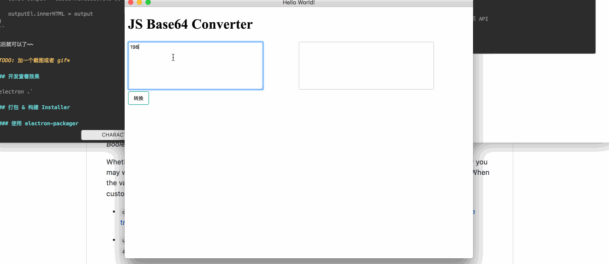

title: Electron 使用初体验
date: 2017-08-21 00:17
updated: 2017-08-21 00:18 
tags:
- JavaScript
- Electron
---
关于 Electron 的流水账记录
<!--more-->

### 上手和使用

下载 `electron-quick-start` 仓库到本地，基于该仓库进行开发

```sh
# Clone the Quick Start repository
$ git clone https://github.com/electron/electron-quick-start

# Go into the repository
$ cd electron-quick-start

# Install the dependencies and run
$ npm install && npm start
```

在 quick start 中，入口文件 `main.js` 使用了 Electron 的 API 调起了一个 `BrowserWindow` 的实例，并在这个实例中，打开了一个在本地的 HTML 文件 `index.html`：

```js
function createWindow () {
  // Create the browser window.
  mainWindow = new BrowserWindow({width: 800, height: 600})

  // and load the index.html of the app.
  mainWindow.loadURL(url.format({
    pathname: path.join(__dirname, 'index.html'),
    protocol: 'file:',
    slashes: true
  }))

  // Open the DevTools.
  // mainWindow.webContents.openDevTools()

  // Emitted when the window is closed.
  mainWindow.on('closed', function () {
    // Dereference the window object, usually you would store windows
    // in an array if your app supports multi windows, this is the time
    // when you should delete the corresponding element.
    mainWindow = null
  })
}
```

接下来的事情就交给这个 HTML 文件了，你可以根据自己的实际需要随意编写，在 `base64-convertor` 这个应用中，我需要在前端展示一个 "一键转换" 的功能，所以需要一个输入框和一个输出结果的框，以及一个 "转换" 按钮。

```html
<div class="column">
    <div>
        <textarea class="box" id="input"></textarea>
    </div>
    <button id="convert" class="btn">转换</button>
</div>
<div class="column">
    <div id="output" class="box"></div>
</div>
```

然后我们需要在点击转换按钮时，调用 `js-base64` 的 API 将用户输入的字符串进行转换。首先在 `index.html` 里面引入 JS 脚本：

```html
<!DOCTYPE html>
<html>
  <head>
    <!-- 省略... -->
  </head>
  <body>
    <!-- 省略... -->
    
    <script>
        // You can also require other files to run in this process
        require('./renderer.js')
    </script>
  </body>
</html>
```

注意到我们可以直接在页面内使用 `require` 方法，这个和一般的 Web 网页开发有所不同。在 `renderer.js` 里面我们编写实际的逻辑：

```js
// renderer.js

const Base64 = require('js-base64').Base64

let inputEl = document.getElementById('input')
let outputEl = document.getElementById('output')
let convertBtn = document.getElementById('convert')

convertBtn.addEventListener('click', () => {
    const val = inputEl.value
    const output = Base64.encode(val) // 调用 API

    outputEl.innerHTML = output
})
```

然后就可以了~~



### 开发查看效果

`electron .`

### 打包 & 构建 Installer

使用 [electron-packager](https://github.com/electron-userland/electron-packager) 来进行打包，然后对应 MacOS 和 Windows 不同平台，需要用不同的构建 Installer 方法。以下操作都在 MacOS 上执行。


#### Building Mac OS App

这里我们使用 [electron-installer-dmg](https://github.com/mongodb-js/electron-installer-dmg) 来构建 MacOS 的 installer，其中参数的含义为：

* `asar=true`：在打包过程中使用 [asar](https://github.com/electron/asar)，将应用的源代码打包成一个压缩包
* `--overwrite`：总是覆写原有路径上的同名文件
* `--platform=darwin`：构建 Mac OS 应用（若需要在 Mac Apple Store 上架则需要指明是 `mas` ）
* `--out=builds`：输出到 `builds/` 目录下

```sh
# 打包应用
ELECTRON_MIRROR="https://npm.taobao.org/mirrors/electron" electron-packager . --overwrite --asar=true base64-convertor --platform=darwin --out=builds

# 构建安装包（Installer）
electron-install-dmg --out=installers --overwrite ./builds/base64-convertor-darwin
```

值得一提的是，应用的名字不可以超过 27 个字：https://github.com/LinusU/node-appdmg/issues/48

#### Building Windows App

在 Mac OS 系统上构建 Windows 应用，需要的步骤会更繁琐一些。~~其实我觉得必要性也不是太大~~

本着尝试的态度，还是试了一下整个流程，这里仅列出打包 win32 的操作，win64 的并没有尝试。

**准备工作：下载 Wine, Mono**

在非 Windows 平台中，需要 [提前安装 wine 和 mono](https://github.com/electron/windows-installer/issues/112#issuecomment-229922112)：

```sh
brew install wine
brew install mono
```

**打包应用**

```sh
ELECTRON_MIRROR=\"https://npm.taobao.org/mirrors/electron/\" electron-packager . --overwrite --asar=true base64-convertor --platform=win32 --out=builds
```

**构建 Windows Installer**

参照了 @crilleengvall 的 electron 教程中 [关于 windows installer 的这篇](https://www.christianengvall.se/electron-windows-installer/)

```sh
node ./create-win32-installer.js
```

```js
// create-win32-installer.js
const createWindowsInstaller = require('electron-winstaller').createWindowsInstaller
const path = require('path')

function getInstallerConfig () {
    const rootPath = path.join('./')
    const outPath = path.join(rootPath, 'builds')
    
    const config = { 
        appDirectory: path.join(outPath, 'base64-convertor-win32-x64'),
        authors: 'Allen Wu',
        noMsi: true,
        outputDirectory: path.join(rootPath, 'installers'),
        exe: 'base64-convertor.exe',
        setupExe: 'base64-convertor-installer.exe',
        setupIcon: path.join(rootPath, 'assets', 'icons', 'hiido.ico')
    }

    return Promise.resolve(config)
}

getInstallerConfig()
    .then(createWindowsInstaller)
    .catch(err => {
        console.error(err.message || err)
        process.exit(1)
    })
```

如果在过程中遇到了 `spawn mono ENOENT` 的问题，就是没有安装 `mono` 这个依赖的原因：https://github.com/electron/windows-installer/issues/112

### TODO

尝试其他 electron 的打包工具，比如：

* [electron-builder](https://github.com/electron-userland/electron-builder)
* [electron-forge](https://github.com/electron-userland/electron-forge)

### Reference

* [@crilleengvall 的 electron 教程](https://www.christianengvall.se/electron-packager-tutorial/)
* [electron/windows-installer](https://github.com/electron/windows-installer)
* [Squirrel/Squirrel.Windows](https://github.com/Squirrel/Squirrel.Windows)